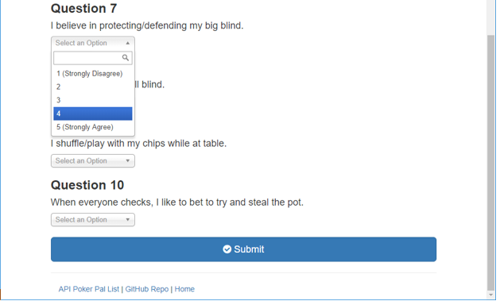
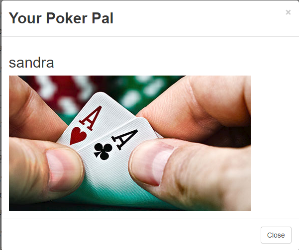

# Poker Pal

Poker Pal implements a matching process based on the uesr's response to a ten question survey about Poker strategy.
 The user responds to questions with values from 1 (Strongly Disagree) to 5 (Strongly Agree). When the survey is submitted, an existing user record closest to the current user's responses is found and returned. The closest set of user responses is defined as the set with the lowest absolute difference for all ten questions combined.

## Heroku Demo:
Poker Pal is deployed to Heroku for you to
try it out. Please click it [here](https://calm-depths-23604.herokuapp.com/).

### Home Page:

### Survey Page:
User selects the Take Survey button.

The user select  values from 1 (Strongly Disagree) to 5 (Strongly Agree). 

### Poker Pal:
Once the user selects Submit the best Poker Pal
match will diplay to the user.

### Api Data:
Secting the Api Poker Pal Link display the 
friends data.

### GitHub:
Selecting the GitHub Repo will open the
Friend Finder GitHub. 
GitHub [link](https://github.com/tschatzmann/FriendFinder).

## Technologies Used:
- JavaScript
- jQuery
- node.js
- Express.js
- HTML
- Bootstrap

## Getting Started:
These instructions will get you a copy of the project up and running on your local machine for development and testing purposes. See deployment for notes on how to deploy the project on a live system.

## Installations:
To install the application follow the instructions below:
- git clone https://github.com/tschatzmann/FriendFinder.git
- cd FriendFinder
- npm install

## Locally:
The application is able to run locally.
Update the PORT information in the server.js file. 
var PORT = process.env.PORT || 3030;
The application will now be running locally on PORT, in this case that is port 3030. You can then access it locally from your browser at the URL localhost:PORT, in this case localhost:3030.

